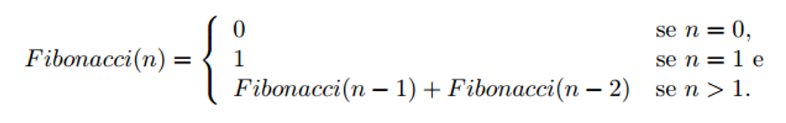

# Exercícios Práticos
## Questão 03

### Implemente, em Linguagem Java, um método que calcula o enésimo termo da série de Fibonacci, tendo como base a descrição matemática recursiva a seguir.
 

#### Exemplo: Primeiros números da série de Fibonacci 0, 1, 1, 2, 3, 5, 8, 13, 21, 34, 55, 89, 144, 233, …