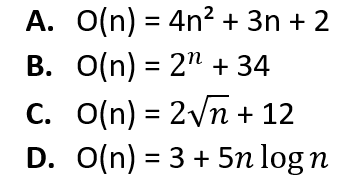

# Exercícios Práticos
## Questão 04

### Dados quatro algoritmos (A, B, C e D) e suas respectivas fórmulas gerais, analise a complexidade de cada um deles e classifique-os em ordem crescente de complexidade. 
 

Resposta:

Ordem crescente de complexidade: D, C, A, B