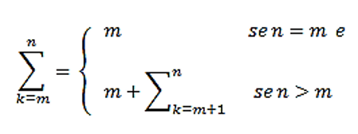

# Exercícios Práticos
## Questão 12

### Implemente, em Java, um método recursivo que representa a definição matemática recursiva a seguir. Além disso, responda: a implementação recursiva seria sua primeira opção para resolver o problema do somatório de números inteiros? 

### Resposta:

Uma outra opção de resolução seria utilizando os loops while ou for. 